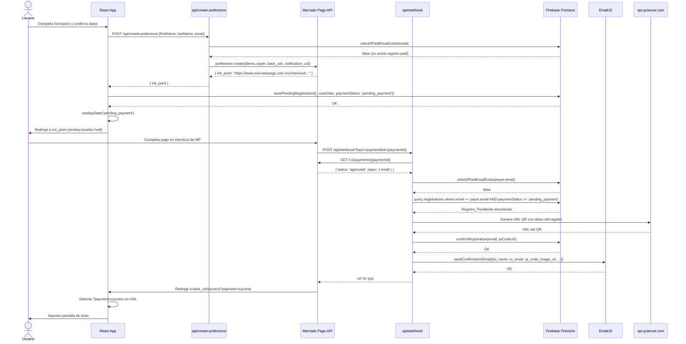
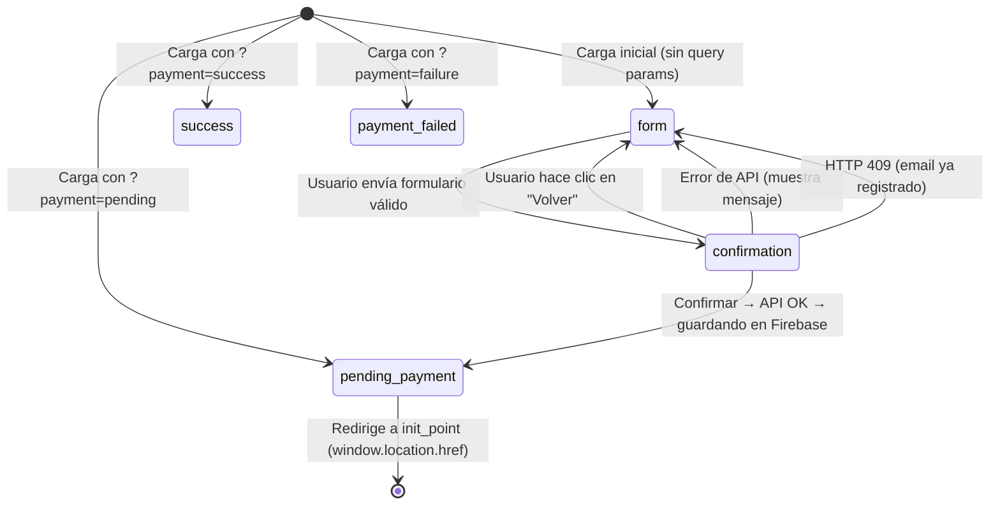

# Design Document — MercadoPago Checkout

## Overview

Este documento describe el diseño técnico para integrar Mercado Pago Checkout Pro en la app de pre-registro del evento "ESTÁS MIRANDO EN RADIANES". El flujo actual (formulario → confirmar → Firebase → email con QR) se extiende con un paso de pago obligatorio: el usuario es redirigido a Mercado Pago, y solo tras un pago aprobado el webhook confirma el registro en Firebase y envía el email con QR.

La solución se apoya en dos Vercel Serverless Functions (`api/create-preference.ts` y `api/webhook.ts`) que mantienen las credenciales secretas de MP fuera del cliente React. El frontend React 19 + TypeScript + Vite no cambia de stack; se extienden los tipos, el estado de la app y los servicios existentes.

**Stack técnico:**
- Frontend: React 19 + TypeScript + Vite, desplegado en Vercel
- Backend: Vercel Serverless Functions (Node.js 20.x)
- Base de datos: Firebase Firestore (SDK cliente, inicialización condicional en Node.js)
- Email: EmailJS (`@emailjs/browser` — usado desde el webhook en Node.js)
- Pagos: Mercado Pago SDK oficial (`mercadopago` npm package)
- QR: `api.qrserver.com` (API pública, sin autenticación)

---

## Architecture

El flujo completo se divide en tres fases:

1. **Fase de inicio de pago** (cliente React + Create_Preference_Function)
2. **Fase de procesamiento de pago** (Mercado Pago + Webhook_Function)
3. **Fase de retorno** (cliente React detecta query params de back_url)



### Diagrama de estados de la App



---

## Components and Interfaces

### 1. `api/create-preference.ts` — Vercel Serverless Function

**Responsabilidad:** Crear una preferencia de pago en Mercado Pago y retornar el `init_point`.

**Contrato HTTP:**

```
POST /api/create-preference
Content-Type: application/json

Request body:
{
  "firstName": string,   // requerido, no vacío
  "lastName": string,    // requerido, no vacío
  "email": string        // requerido, no vacío
}

Response 200:
{
  "init_point": string   // URL de pago de Mercado Pago
}

Response 400:
{
  "error": "Missing required fields"
}

Response 409:
{
  "error": "Este email ya está registrado y tiene un pago confirmado."
}

Response 500:
{
  "error": "Error al crear la preferencia de pago."
}
```

**Variables de entorno requeridas:**
- `MP_ACCESS_TOKEN` — credencial secreta de MP (solo en Vercel, nunca en el cliente)
- `VERCEL_URL` — inyectada automáticamente por Vercel en producción

**Lógica interna:**
1. Validar presencia de `firstName`, `lastName`, `email`
2. Consultar Firebase: si existe registro con `email` y `paymentStatus: 'paid'` → HTTP 409
3. Inicializar cliente MP con `MP_ACCESS_TOKEN`
4. Construir y crear la preferencia con los campos requeridos
5. Retornar `{ init_point: result.init_point }`

**Preferencia MP construida:**
```typescript
{
  items: [{
    id: 'entrada-evento',
    title: 'Entrada — ESTÁS MIRANDO EN RADIANES',
    quantity: 1,
    unit_price: 550,
    currency_id: 'MXN',
  }],
  payer: { name: firstName, surname: lastName, email },
  back_urls: {
    success: `${appUrl}/?payment=success`,
    failure: `${appUrl}/?payment=failure`,
    pending: `${appUrl}/?payment=pending`,
  },
  auto_return: 'approved',
  notification_url: `${appUrl}/api/webhook`,
}
```

---

### 2. `api/webhook.ts` — Vercel Serverless Function

**Responsabilidad:** Recibir notificaciones de pago de MP, verificar el estado, confirmar el registro en Firebase y enviar el email con QR.

**Contrato HTTP:**

```
POST /api/webhook?topic=payment&id={paymentId}

Response 200: (siempre, salvo error de MP_API)
  (body vacío)

Response 500:
{
  "error": "Error al consultar el pago."
}
```

**Variables de entorno requeridas:**
- `MP_ACCESS_TOKEN`
- `VITE_FIREBASE_*` — configuración de Firebase (o equivalentes sin prefijo VITE para Node.js)

**Nota sobre Firebase en Node.js:** El webhook corre en Node.js (Vercel Function), no en el browser. Se usa el SDK cliente de Firebase (`firebase/app`, `firebase/firestore`) con inicialización condicional (`getApps().length === 0`) para evitar re-inicialización en invocaciones calientes. Las credenciales de Firebase son las mismas que usa el cliente React.

**Nota sobre EmailJS en Node.js:** `@emailjs/browser` puede usarse en Node.js con la misma API. Se inicializa con `emailjs.init(publicKey)` antes de llamar a `emailjs.send()`.

**Lógica interna:**
1. Verificar `topic === 'payment'` e `id` presente; si no → HTTP 200 sin acción
2. Consultar `GET /v1/payments/{id}` via SDK de MP
3. Si `status !== 'approved'` → HTTP 200 sin acción
4. Extraer `payer.email` del pago
5. Verificar en Firebase si ya existe registro con `paymentStatus: 'paid'` para ese email → si sí, HTTP 200 sin acción (idempotencia)
6. Buscar Registro_Pendiente en Firebase (`email == payer.email`, `paymentStatus == 'pending_payment'`)
7. Si no se encuentra → log + HTTP 200
8. Generar URL de QR via `api.qrserver.com`
9. Actualizar documento en Firebase: `qrCodeUrl`, `paymentStatus: 'paid'`
10. Enviar email via EmailJS (si falla → log, no revertir Firebase, HTTP 200)
11. Retornar HTTP 200

---

### 3. Modificaciones al cliente React

#### `types.ts`

```typescript
export interface UserData {
  firstName: string;
  lastName: string;
  email: string;
}

export interface RegistrationData extends UserData {
  qrCodeUrl: string;
  paymentStatus: 'pending_payment' | 'paid';
  registeredAt: string;
}

export type AppState = 'form' | 'confirmation' | 'pending_payment' | 'success' | 'payment_failed';
```

#### `config.ts` — adición

```typescript
export const mpConfig = {
  publicKey: import.meta.env.VITE_MP_PUBLIC_KEY || 'APP_USR-d5189982-3f09-4684-8823-bd7270b3b337'
};
```

#### `App.tsx` — nuevo `handleConfirmRegistration`

```typescript
const handleConfirmRegistration = useCallback(async () => {
  setIsSubmitting(true);
  setError(null);
  try {
    // 1. Llamar a create-preference
    const response = await fetch('/api/create-preference', {
      method: 'POST',
      headers: { 'Content-Type': 'application/json' },
      body: JSON.stringify({
        firstName: userData.firstName,
        lastName: userData.lastName,
        email: userData.email,
      }),
    });

    if (response.status === 409) {
      setError('Este email ya está registrado. Revisa tu bandeja de entrada.');
      setAppState('form');
      return;
    }

    if (!response.ok) {
      throw new Error('Error al crear la preferencia de pago.');
    }

    const { init_point } = await response.json();

    // 2. Guardar Registro_Pendiente en Firebase
    await savePendingRegistration({
      firstName: userData.firstName,
      lastName: userData.lastName,
      email: userData.email,
      paymentStatus: 'pending_payment',
      registeredAt: new Date().toISOString(),
    });

    // 3. Redirigir a Mercado Pago
    setAppState('pending_payment');
    window.location.href = init_point;

  } catch (err: any) {
    setError('Ocurrió un error. Inténtalo de nuevo.');
    setAppState('form');
  } finally {
    setIsSubmitting(false);
  }
}, [userData]);
```

#### `App.tsx` — detección de query params al cargar

```typescript
// En el useState inicial de appState:
const getInitialAppState = (): AppState => {
  const params = new URLSearchParams(window.location.search);
  const payment = params.get('payment');
  if (payment === 'success') return 'success';
  if (payment === 'failure') return 'payment_failed';
  if (payment === 'pending') return 'pending_payment';
  return 'form';
};

const [appState, setAppState] = useState<AppState>(getInitialAppState);
```

---

### 4. `services/firebaseService.ts` — nuevas funciones

```typescript
/**
 * Guarda un registro pendiente de pago en Firestore.
 */
export const savePendingRegistration = async (
  data: Omit<RegistrationData, 'qrCodeUrl'>
): Promise<void> => { ... }

/**
 * Actualiza un registro pendiente a confirmado (paid) con la URL del QR.
 * Busca por email con paymentStatus: 'pending_payment'.
 */
export const confirmRegistration = async (
  email: string,
  qrCodeUrl: string
): Promise<void> => { ... }

/**
 * Verifica si ya existe un registro con paymentStatus: 'paid' para el email dado.
 */
export const checkIfPaidEmailExists = async (email: string): Promise<boolean> => { ... }
```

---

### 5. `vercel.json` — adición de runtime

```json
{
  "functions": {
    "api/*.ts": {
      "runtime": "nodejs20.x"
    }
  }
}
```

---

### 6. `package.json` — nuevas dependencias

```json
{
  "dependencies": {
    "mercadopago": "^2.x.x"
  },
  "devDependencies": {
    "@vercel/node": "^5.x.x"
  }
}
```

---

## Data Models

### Documento en Firestore — colección `registrations`

```typescript
interface FirestoreRegistration {
  // Campos existentes
  firstName: string;          // "Juan"
  lastName: string;           // "Pérez"
  name: string;               // "Juan Pérez" (firstName + lastName)
  email: string;              // "juan@example.com" (lowercase)
  registeredAt: Timestamp;    // Firestore Timestamp

  // Campos nuevos
  paymentStatus: 'pending_payment' | 'paid';
  qrCodeUrl: string;          // "" en pending_payment, URL completa en paid
}
```

**Índices requeridos en Firestore:**
- Índice compuesto: `email ASC` + `paymentStatus ASC` (para la query de duplicados en el webhook)
- Índice simple: `email ASC` (ya existente para `checkIfEmailExists`)

### Variables de entorno

| Variable | Entorno | Descripción |
|---|---|---|
| `MP_ACCESS_TOKEN` | Vercel (server) | Credencial secreta de MP. Nunca expuesta al cliente. |
| `VITE_MP_PUBLIC_KEY` | Vercel (build) + `.env` local | Clave pública de MP para el cliente React. |
| `VERCEL_URL` | Vercel (auto) | Dominio del deployment. Inyectado automáticamente. |
| `VITE_FIREBASE_*` | Vercel (build) + `.env` local | Configuración de Firebase para el cliente. |

**Nota de seguridad:** Las variables `VITE_*` son expuestas al bundle del cliente por Vite. `MP_ACCESS_TOKEN` NO debe tener el prefijo `VITE_` y solo debe existir en el entorno de Vercel Functions.

---

## Correctness Properties

*Una propiedad es una característica o comportamiento que debe mantenerse verdadero en todas las ejecuciones válidas del sistema — esencialmente, una declaración formal sobre lo que el software debe hacer. Las propiedades sirven como puente entre especificaciones legibles por humanos y garantías de corrección verificables por máquinas.*

### Property 1: Estructura de la preferencia de pago

*Para cualquier* combinación válida de `firstName`, `lastName` y `email`, la preferencia construida por `Create_Preference_Function` y enviada a MP_API debe contener siempre: `items[0].title === 'Entrada — ESTÁS MIRANDO EN RADIANES'`, `items[0].unit_price === 550`, `items[0].currency_id === 'MXN'`, y `payer.email === email` (el email del input).

**Validates: Requirements 1.2**

---

### Property 2: URLs de retorno y notificación siempre apuntan al dominio correcto

*Para cualquier* valor de `VERCEL_URL` (o URL de la app), las `back_urls` (success, failure, pending) y la `notification_url` generadas por `Create_Preference_Function` deben comenzar con la URL base de la app, y `notification_url` debe terminar en `/api/webhook`.

**Validates: Requirements 1.6, 1.7**

---

### Property 3: Validación de campos requeridos retorna HTTP 400

*Para cualquier* combinación de campos faltantes o vacíos en el body de `POST /api/create-preference` (ausencia de `firstName`, `lastName` o `email`, o cualquier subconjunto de ellos), la función debe retornar HTTP 400.

**Validates: Requirements 1.10**

---

### Property 4: Respuesta de create-preference siempre contiene init_point

*Para cualquier* respuesta exitosa de MP_API que contenga un `init_point`, `Create_Preference_Function` debe retornar exactamente `{ init_point: <valor> }` con HTTP 200.

**Validates: Requirements 1.3**

---

### Property 5: Pagos no aprobados no modifican Firebase

*Para cualquier* notificación de webhook con un pago cuyo `status` sea distinto de `'approved'` (ej. `'pending'`, `'rejected'`, `'cancelled'`, `'in_process'`), el `Webhook_Function` no debe realizar ninguna escritura en Firebase y debe retornar HTTP 200.

**Validates: Requirements 2.7**

---

### Property 6: El webhook usa el email del pagador para buscar el registro

*Para cualquier* pago aprobado con cualquier `payer.email`, el `Webhook_Function` debe consultar Firebase usando exactamente ese email para encontrar el Registro_Pendiente.

**Validates: Requirements 2.2**

---

### Property 7: Idempotencia del webhook — email ya confirmado

*Para cualquier* email que ya tenga un registro con `paymentStatus: 'paid'` en Firebase, el `Webhook_Function` al procesar un nuevo pago aprobado para ese email no debe realizar ninguna actualización en Firebase ni enviar email, y debe retornar HTTP 200.

**Validates: Requirements 2.2, 6.2**

---

### Property 8: Detección de query params de retorno

*Para cualquier* URL de carga de la app que contenga `?payment=success`, `?payment=failure` o `?payment=pending`, la app debe transicionar automáticamente al `AppState` correspondiente (`'success'`, `'payment_failed'`, `'pending_payment'`) sin requerir acción del usuario.

**Validates: Requirements 3.1, 3.2, 3.3**

---

### Property 9: Prevención de duplicados en create-preference

*Para cualquier* email que ya tenga un registro con `paymentStatus: 'paid'` en Firebase, `Create_Preference_Function` debe retornar HTTP 409 sin crear una nueva preferencia en MP_API.

**Validates: Requirements 6.1**

---

### Property 10: Headers CORS presentes en todas las respuestas de create-preference

*Para cualquier* solicitud a `POST /api/create-preference` (incluyendo OPTIONS preflight), la respuesta debe incluir el header `Access-Control-Allow-Origin`.

**Validates: Requirements 5.4**

---

## Error Handling

### Errores en `api/create-preference.ts`

| Condición | Respuesta | Acción del cliente |
|---|---|---|
| Campos faltantes o vacíos | HTTP 400 `{ error: "Missing required fields" }` | Mostrar error, mantener pantalla de confirmación |
| Email ya tiene registro `paid` | HTTP 409 `{ error: "Este email ya está registrado..." }` | Mostrar mensaje específico, no redirigir |
| Error al crear preferencia en MP_API | HTTP 500 `{ error: "Error al crear la preferencia de pago." }` | Mostrar error genérico, mantener pantalla de confirmación |

### Errores en `api/webhook.ts`

| Condición | Respuesta | Efecto en datos |
|---|---|---|
| `topic !== 'payment'` o sin `id` | HTTP 200 | Sin cambios |
| `status !== 'approved'` | HTTP 200 | Sin cambios |
| Error al consultar MP_API | HTTP 500 | Sin cambios (MP reintentará) |
| Registro_Pendiente no encontrado | HTTP 200 + log | Sin cambios |
| Email ya tiene registro `paid` | HTTP 200 | Sin cambios (idempotencia) |
| Error al actualizar Firebase | HTTP 500 | Sin cambios (MP reintentará) |
| Error al enviar email (EmailJS) | HTTP 200 + log | Firebase queda en `paid`, email no enviado |

**Decisión de diseño — EmailJS falla:** Se retorna HTTP 200 para evitar que MP_API reintente el webhook indefinidamente. El registro queda confirmado en Firebase. Se registra el error en logs para revisión manual. El operador puede reenviar el email manualmente si es necesario.

### Errores en el cliente React

| Condición | Comportamiento |
|---|---|
| Error de red al llamar a `/api/create-preference` | Mostrar "Ocurrió un error. Inténtalo de nuevo." en pantalla de confirmación |
| HTTP 409 de `/api/create-preference` | Mostrar "Este email ya está registrado. Revisa tu bandeja de entrada." y volver al formulario |
| HTTP 400/500 de `/api/create-preference` | Mostrar error genérico, mantener pantalla de confirmación |
| `?payment=failure` en URL | Mostrar pantalla `payment_failed` con opción de reintentar (volver al formulario) |
| `?payment=pending` en URL | Mostrar pantalla informativa indicando que el pago está pendiente |

---

## Testing Strategy

### Enfoque dual: tests unitarios + tests de propiedades

La estrategia combina tests de ejemplo para comportamientos específicos y tests de propiedades para invariantes universales. Se usa **Vitest** como test runner (ya compatible con el stack Vite/TypeScript del proyecto).

**Librería de property-based testing:** [`fast-check`](https://github.com/dubzzz/fast-check) — compatible con Vitest, TypeScript, y Node.js. Mínimo 100 iteraciones por propiedad.

### Tests unitarios (ejemplo-based)

**`api/create-preference.test.ts`:**
- Verifica que OPTIONS retorna 200 (CORS preflight)
- Verifica que métodos distintos de POST retornan 405
- Verifica que body vacío retorna 400
- Verifica que HTTP 409 se retorna cuando el email ya tiene registro `paid`
- Verifica que en caso de error de MP_API se retorna 500
- Verifica que la respuesta exitosa contiene `init_point`

**`api/webhook.test.ts`:**
- Verifica que topic distinto de `payment` retorna 200 sin acción
- Verifica que pago con status `pending` no modifica Firebase
- Verifica que pago aprobado sin Registro_Pendiente retorna 200 con log
- Verifica que error de EmailJS no revierte el registro en Firebase
- Verifica que email ya confirmado es ignorado (idempotencia)

**`App.test.tsx`:**
- Verifica que HTTP 409 muestra mensaje de email ya registrado
- Verifica que error de API mantiene pantalla de confirmación
- Verifica que pantalla `pending_payment` muestra indicador de carga
- Verifica que pantalla `success` muestra mensaje sobre demora del email

**`services/firebaseService.test.ts`:**
- Verifica que `savePendingRegistration` guarda con `paymentStatus: 'pending_payment'`
- Verifica que `confirmRegistration` actualiza `paymentStatus` a `'paid'` y `qrCodeUrl`
- Verifica que `checkIfPaidEmailExists` retorna `true` solo para registros `paid`

### Tests de propiedades (property-based)

Cada test usa `fast-check` con mínimo 100 iteraciones y está etiquetado con la propiedad del diseño que valida.

```typescript
// Feature: mercadopago-checkout, Property 1: Estructura de la preferencia de pago
it.prop([fc.record({
  firstName: fc.string({ minLength: 1 }),
  lastName: fc.string({ minLength: 1 }),
  email: fc.emailAddress(),
})])('preference body always has correct fixed fields', async ({ firstName, lastName, email }) => {
  // Arrange: mock MP_API, mock Firebase (no paid email)
  // Act: call create-preference handler
  // Assert: captured preference body has correct title, price, currency, payer
});

// Feature: mercadopago-checkout, Property 2: URLs de retorno y notificación
it.prop([fc.webUrl()])('back_urls and notification_url always point to app domain', async (appUrl) => {
  // Assert: back_urls.success/failure/pending start with appUrl
  // Assert: notification_url === `${appUrl}/api/webhook`
});

// Feature: mercadopago-checkout, Property 3: Validación de campos requeridos
it.prop([fc.record({
  firstName: fc.option(fc.string()),
  lastName: fc.option(fc.string()),
  email: fc.option(fc.string()),
}).filter(body => !body.firstName || !body.lastName || !body.email)])
('missing fields always return HTTP 400', async (body) => {
  // Assert: response.status === 400
});

// Feature: mercadopago-checkout, Property 5: Pagos no aprobados no modifican Firebase
it.prop([fc.constantFrom('pending', 'rejected', 'cancelled', 'in_process', 'refunded')])
('non-approved payment status never writes to Firebase', async (status) => {
  // Assert: no Firebase write calls
  // Assert: response.status === 200
});

// Feature: mercadopago-checkout, Property 8: Detección de query params
it.prop([fc.constantFrom('success', 'failure', 'pending')])
('payment query param determines initial app state', (paymentParam) => {
  // Arrange: mock window.location.search = `?payment=${paymentParam}`
  // Assert: getInitialAppState() returns correct AppState
});

// Feature: mercadopago-checkout, Property 9: Prevención de duplicados
it.prop([fc.emailAddress()])
('paid email always returns HTTP 409 from create-preference', async (email) => {
  // Arrange: mock Firebase to return true for checkIfPaidEmailExists
  // Assert: response.status === 409
});
```

### Tests de integración

- Despliegue en Vercel Preview: verificar que `/api/create-preference` y `/api/webhook` responden correctamente
- Verificar enrutamiento de Vercel (las rutas `/api/*` no interfieren con el frontend React)
- Prueba end-to-end con credenciales de modo prueba de MP: completar flujo completo con tarjeta de prueba

### Smoke tests

- Verificar que `MP_ACCESS_TOKEN` está configurado en Vercel (no hardcodeado)
- Verificar que `api/create-preference.ts` y `api/webhook.ts` existen en el repositorio
- Verificar que TypeScript compila sin errores con los nuevos tipos (`paymentStatus`, `AppState`)
- Verificar que `mpConfig.publicKey` lee desde `VITE_MP_PUBLIC_KEY`
