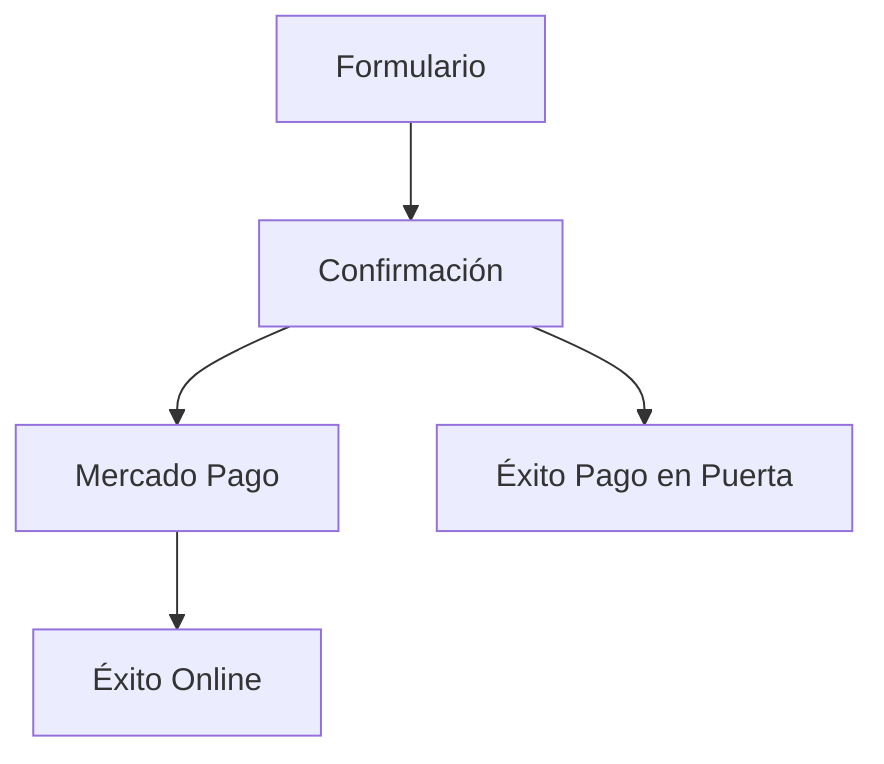

# Diseño Técnico: Flujo de Pago Multi-Opción

## Arquitectura de Estados
Se modificará el estado principal de la aplicación (`AppState`) para incluir una nueva ruta de navegación:

## Cambios en UI/UX
### Pantalla de Confirmación
Se rediseñará el componente `ConfirmationScreen` para presentar dos botones:
- **Botón Primario:** "CONTINUAR AL PAGO (ONLINE)"
- **Botón Secundario:** "REGISTRAR Y PAGAR EN PUERTA"

### Nueva Pantalla: `SuccessPayAtDoorScreen`
- Mantendrá el componente `<Window />`.
- Mostrará un mensaje de agradecimiento y una advertencia de que el pago está pendiente.

## Cambios en Data Schema (Firestore)
Colección `registrations`:
- `paymentStatus`: Se añaden valores `['pending_payment', 'paid', 'pay_at_door']`.
- `registrationType`: (Opcional) `'online' | 'door'`.
