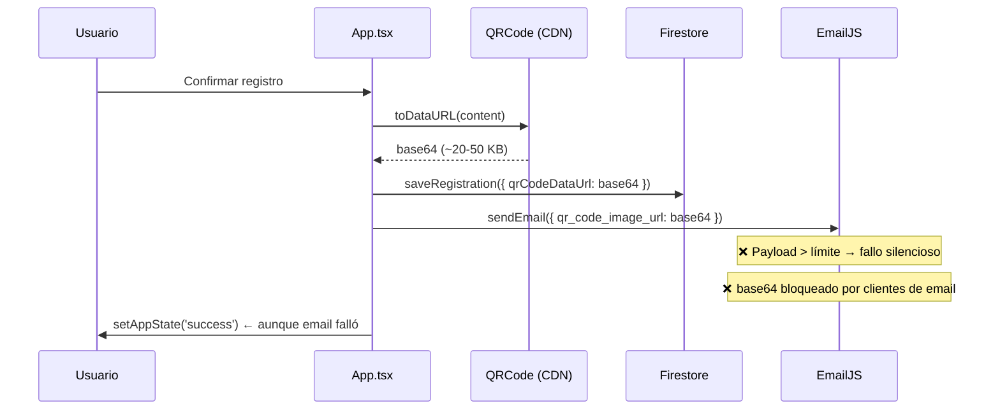
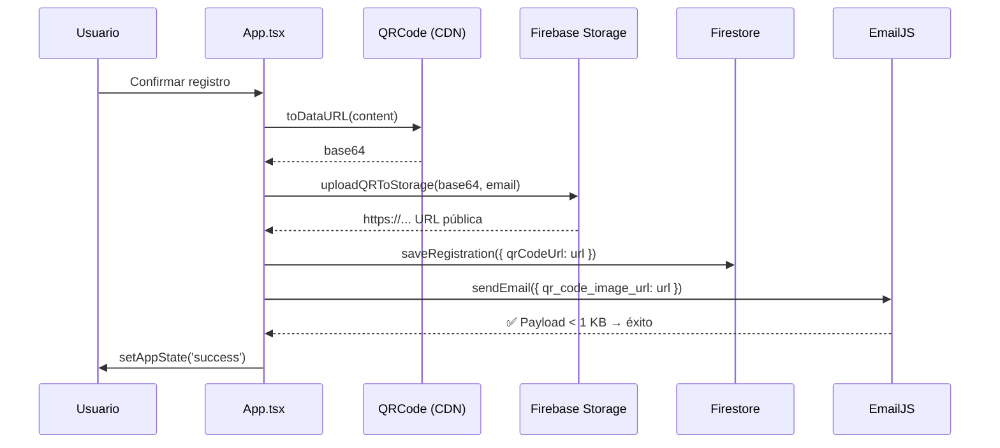

# Design Document: qr-storage-email-fix

## Overview

Este documento describe el diseño técnico para corregir tres bugs críticos en el flujo de pre-registro del evento "ESTÁS MIRANDO EN RADIANES":

1. **QR invisible en emails**: Los clientes de correo bloquean imágenes base64 inline por políticas de seguridad.
2. **Emails silenciosamente fallidos**: El payload base64 (~20–50 KB) supera el límite de EmailJS, causando fallos que la app no reporta.
3. **Errores silenciados en producción**: El bloque `catch` solo hace `console.error` en desarrollo, impidiendo diagnóstico en producción.

La solución introduce Firebase Storage como capa de almacenamiento para los QR. El flujo pasa de enviar base64 directamente a Firestore y EmailJS, a subir el QR a Storage, obtener una URL `https://` pública, y usar esa URL en ambos destinos. Adicionalmente se mejora el manejo de errores para que sea visible en todos los entornos y descriptivo por tipo de fallo.

### Alcance

- **Archivos modificados**: `types.ts`, `services/firebaseService.ts`, `App.tsx`
- **Archivos no modificados**: `services/emailService.ts`, `config.ts`, `components/`, `index.tsx`
- **Infraestructura**: Firebase Storage debe estar habilitado en el proyecto `invitro-radianes`

---

## Architecture

### Flujo actual (con bugs)



### Flujo nuevo (corregido)



### Principio de diseño: fail-fast con propagación de errores

Cada paso del flujo lanza un error con mensaje descriptivo si falla. El orquestador (`handleConfirmRegistration`) captura el error, lo registra siempre con `console.error`, y muestra un mensaje específico al usuario según el origen del fallo. Los pasos posteriores a un fallo nunca se ejecutan.

---

## Components and Interfaces

### `uploadQRToStorage` (nuevo — `services/firebaseService.ts`)

```typescript
export const uploadQRToStorage = async (
  base64DataUrl: string,
  email: string
): Promise<string>
```

**Responsabilidad**: Subir el QR como PNG a Firebase Storage y retornar la URL pública.

**Contrato**:
- Entrada: `base64DataUrl` en formato `data:image/png;base64,...`, `email` como identificador único del archivo.
- Salida: URL `https://` pública de Firebase Storage.
- Error: lanza `Error('Could not upload QR code to storage.')` si la subida falla.
- Ruta de almacenamiento: `qr-codes/{email}.png` (sobreescribe si ya existe).

**Dependencias del SDK**:
```typescript
import { getStorage, ref, uploadString, getDownloadURL } from 'firebase/storage';
```

### `saveRegistration` (modificado — `services/firebaseService.ts`)

La firma no cambia, pero el tipo `RegistrationData` que consume cambia de `qrCodeDataUrl` a `qrCodeUrl`. El documento guardado en Firestore contendrá `qrCodeUrl` (URL https://) en lugar de base64.

### `handleConfirmRegistration` (modificado — `App.tsx`)

Orquestador del flujo completo. Cambios:
1. Llama a `uploadQRToStorage` después de generar el QR y antes de guardar en Firestore.
2. Pasa `qrCodeUrl` (URL) en lugar de `qrCodeDataUrl` (base64) a `saveRegistration`.
3. Pasa la URL a `sendConfirmationEmail`.
4. El bloque `catch` siempre llama `console.error` (sin condicional de `NODE_ENV`).
5. El bloque `catch` muestra mensajes de error específicos según el origen del fallo.

### `RegistrationData` (modificado — `types.ts`)

```typescript
export interface RegistrationData extends UserData {
    qrCodeUrl: string;      // URL https:// de Firebase Storage (antes: qrCodeDataUrl)
    registeredAt: string;
}
```

---

## Data Models

### Documento en Firestore — colección `registrations`

**Esquema anterior**:
```typescript
{
  firstName: string,
  lastName: string,
  name: string,
  email: string,
  qrCodeDataUrl: string,   // base64 ~20-50 KB ← eliminado
  registeredAt: Timestamp
}
```

**Esquema nuevo**:
```typescript
{
  firstName: string,
  lastName: string,
  name: string,
  email: string,
  qrCodeUrl: string,       // URL https:// ~100-200 chars ← nuevo
  registeredAt: Timestamp
}
```

**Impacto en tamaño**: reducción de ~20–50 KB a ~200 bytes por documento.

### Archivo en Firebase Storage

- **Ruta**: `qr-codes/{email}.png`
- **Formato**: PNG (subido como `data_url` via `uploadString`)
- **Acceso**: público de lectura (reglas de Storage)
- **Comportamiento en duplicados**: sobreescritura (comportamiento por defecto de Firebase Storage)

### Payload de EmailJS

**Antes**: `qr_code_image_url` contenía ~20–50 KB de base64.  
**Después**: `qr_code_image_url` contiene una URL `https://` de ~100–200 caracteres. El payload total queda bien por debajo del límite de 50 KB de EmailJS.

---

## Correctness Properties

*Una propiedad es una característica o comportamiento que debe mantenerse verdadero en todas las ejecuciones válidas del sistema — esencialmente, una declaración formal sobre lo que el sistema debe hacer. Las propiedades sirven como puente entre especificaciones legibles por humanos y garantías de corrección verificables por máquina.*

### Property 1: La URL retornada por Storage tiene esquema https://

*Para cualquier* base64DataUrl válido y email string, cuando `uploadQRToStorage` completa exitosamente (con Firebase Storage mockeado), la URL retornada debe comenzar con `"https://"`.

**Validates: Requirements 1.2**

---

### Property 2: El documento de Firestore contiene exactamente los campos requeridos

*Para cualquier* objeto `RegistrationData` válido con `qrCodeUrl`, el documento pasado a `addDoc` debe contener los campos `firstName`, `lastName`, `name`, `email`, `qrCodeUrl` y `registeredAt`, y NO debe contener el campo `qrCodeDataUrl`.

**Validates: Requirements 2.1, 2.2, 2.3**

---

### Property 3: El payload de EmailJS con URL es menor a 50 KB

*Para cualquier* `EmailParams` donde `qr_code_image_url` es una URL `https://` (no base64), el tamaño de `JSON.stringify(params)` debe ser menor a 50.000 bytes.

**Validates: Requirements 3.3**

---

### Property 4: El flujo se detiene ante cualquier fallo y muestra error

*Para cualquier* paso del Registration_Flow que lance un error (Storage, Firestore o Email), los pasos posteriores no deben ejecutarse, el estado de la app debe retornar a `'form'`, y el campo `error` debe ser no-nulo.

**Validates: Requirements 4.2, 4.3**

---

### Property 5: console.error siempre se llama ante cualquier error

*Para cualquier* error lanzado durante el Registration_Flow, independientemente del valor de `process.env.NODE_ENV`, `console.error` debe ser invocado con el error capturado.

**Validates: Requirements 5.1**

---

### Property 6: Los mensajes de error son específicos según el servicio que falla

*Para cualquier* error lanzado por un servicio específico (Storage, Firestore o Email), el mensaje mostrado al usuario debe corresponder exactamente al mensaje definido para ese servicio:
- Storage → `"No se pudo procesar el código QR. Inténtalo de nuevo."`
- Firestore → `"No se pudo guardar el registro. Inténtalo de nuevo."`
- Email → `"No se pudo enviar el email de confirmación. Inténtalo de nuevo."`

**Validates: Requirements 5.3, 5.4, 5.5**

---

## Error Handling

### Estrategia general

El flujo usa propagación de errores explícita: cada función de servicio lanza un `Error` con mensaje descriptivo cuando falla. El orquestador (`handleConfirmRegistration`) tiene un único bloque `try/catch` que:

1. Siempre registra el error con `console.error` (sin condicional de entorno).
2. Determina el mensaje de usuario según el contenido del mensaje de error.
3. Llama a `setError(errorMessage)` para mostrar el mensaje en la UI.
4. Llama a `setAppState('form')` para retornar al formulario.
5. El bloque `finally` siempre llama `setIsSubmitting(false)`.

### Tabla de errores

| Origen del fallo | Mensaje de error del servicio | Mensaje mostrado al usuario |
|---|---|---|
| `uploadQRToStorage` | `"Could not upload QR code to storage."` | `"No se pudo procesar el código QR. Inténtalo de nuevo."` |
| `saveRegistration` | `"Could not save registration data."` | `"No se pudo guardar el registro. Inténtalo de nuevo."` |
| `sendConfirmationEmail` | `"Could not send confirmation email."` | `"No se pudo enviar el email de confirmación. Inténtalo de nuevo."` |
| QRCode no cargado | `"QRCode library not loaded"` | `"Ocurrió un error. Inténtalo de nuevo."` (fallback) |
| Email duplicado | (manejo especial, no es error) | `"Este email ya ha sido registrado."` |

### Lógica de detección de origen en el catch

```typescript
} catch (err: any) {
  console.error("Registration failed:", err);
  let errorMessage = 'Ocurrió un error. Inténtalo de nuevo.';
  if (err.message?.includes('upload') || err.message?.includes('storage')) {
    errorMessage = 'No se pudo procesar el código QR. Inténtalo de nuevo.';
  } else if (err.message?.includes('email') || err.message?.includes('confirmation')) {
    errorMessage = 'No se pudo enviar el email de confirmación. Inténtalo de nuevo.';
  } else if (err.message?.includes('save') || err.message?.includes('registration')) {
    errorMessage = 'No se pudo guardar el registro. Inténtalo de nuevo.';
  }
  setError(errorMessage);
  setAppState('form');
}
```

### Prerequisito de infraestructura

Firebase Storage debe estar habilitado manualmente en la consola de Firebase antes de que el nuevo flujo funcione:

1. Ir a [Firebase Console](https://console.firebase.google.com) → proyecto `invitro-radianes`
2. Navegar a **Storage** → **Get Started**
3. Seleccionar modo de prueba o configurar las siguientes reglas:

```
rules_version = '2';
service firebase.storage {
  match /b/{bucket}/o {
    match /qr-codes/{allPaths=**} {
      allow read: if true;
      allow write: if true; // modo prueba — cambiar antes de producción
    }
  }
}
```

> **Nota**: El `storageBucket` ya está configurado en `config.ts` como `invitro-radianes.firebasestorage.app`. Solo falta activar el servicio en la consola.

---

## Testing Strategy

### Evaluación de PBT

Este feature es adecuado para property-based testing en la capa de lógica pura y servicios mockeados. Las funciones de servicio tienen contratos claros (entrada → salida), y el orquestador tiene propiedades universales sobre manejo de errores que se benefician de múltiples iteraciones. Se excluyen de PBT las verificaciones de infraestructura (Firebase Storage real, Firestore real) que son tests de integración.

**Librería PBT recomendada**: [fast-check](https://github.com/dubzzz/fast-check) (compatible con TypeScript/Vite, sin dependencias adicionales de runtime).

### Tests unitarios (ejemplo-based)

Cubren comportamientos específicos y casos de error:

- `uploadQRToStorage` lanza `"Could not upload QR code to storage."` cuando `uploadString` falla.
- `uploadQRToStorage` llama a `uploadString` con el formato `'data_url'`.
- `sendConfirmationEmail` lanza `"Could not send confirmation email."` cuando `emailjs.send` falla.
- `handleConfirmRegistration` ejecuta los 4 pasos en el orden correcto cuando todos tienen éxito.
- `handleConfirmRegistration` transiciona a `'success'` cuando todos los pasos tienen éxito.
- `handleConfirmRegistration` mantiene `isSubmitting: true` durante la ejecución y `false` al finalizar.
- TypeScript compila sin errores (`tsc --noEmit`).

### Tests de propiedades (property-based)

Cada test debe ejecutarse con mínimo 100 iteraciones. Tag format: `Feature: qr-storage-email-fix, Property {N}: {texto}`.

**Property 1** — URL retornada tiene esquema https://:
```typescript
// Feature: qr-storage-email-fix, Property 1: La URL retornada por Storage tiene esquema https://
fc.assert(fc.asyncProperty(
  fc.string(), // email
  async (email) => {
    mockGetDownloadURL.mockResolvedValue(`https://storage.googleapis.com/qr-codes/${email}.png`);
    const url = await uploadQRToStorage('data:image/png;base64,abc123', email);
    return url.startsWith('https://');
  }
), { numRuns: 100 });
```

**Property 2** — Documento de Firestore contiene campos requeridos y no contiene base64:
```typescript
// Feature: qr-storage-email-fix, Property 2: El documento de Firestore contiene exactamente los campos requeridos
fc.assert(fc.asyncProperty(
  fc.record({ firstName: fc.string(), lastName: fc.string(), email: fc.emailAddress(), qrCodeUrl: fc.webUrl() }),
  async (data) => {
    await saveRegistration({ ...data, name: `${data.firstName} ${data.lastName}`, registeredAt: new Date().toISOString() });
    const savedDoc = mockAddDoc.mock.calls[0][1];
    return 'qrCodeUrl' in savedDoc && !('qrCodeDataUrl' in savedDoc);
  }
), { numRuns: 100 });
```

**Property 3** — Payload de EmailJS con URL es menor a 50 KB:
```typescript
// Feature: qr-storage-email-fix, Property 3: El payload de EmailJS con URL es menor a 50 KB
fc.assert(fc.property(
  fc.record({
    to_name: fc.string(),
    to_email: fc.emailAddress(),
    qr_code_image_url: fc.webUrl(),
    event_name: fc.string(),
    event_date: fc.string(),
    event_location: fc.string(),
    event_time: fc.string(),
  }),
  (params) => JSON.stringify(params).length < 50000
), { numRuns: 100 });
```

**Property 4** — El flujo se detiene ante cualquier fallo y muestra error:
```typescript
// Feature: qr-storage-email-fix, Property 4: El flujo se detiene ante cualquier fallo y muestra error
// Testar para cada posición de fallo (Storage, Firestore, Email)
fc.assert(fc.asyncProperty(
  fc.constantFrom('storage', 'firestore', 'email'),
  async (failingStep) => {
    // configurar mock para que el paso indicado falle
    // ejecutar handleConfirmRegistration
    // verificar que appState === 'form' y error !== null
  }
), { numRuns: 100 });
```

**Property 5** — console.error siempre se llama:
```typescript
// Feature: qr-storage-email-fix, Property 5: console.error siempre se llama ante cualquier error
fc.assert(fc.asyncProperty(
  fc.constantFrom('production', 'development', 'test'),
  async (nodeEnv) => {
    process.env.NODE_ENV = nodeEnv;
    mockUploadQRToStorage.mockRejectedValue(new Error('Could not upload QR code to storage.'));
    await handleConfirmRegistration();
    return consoleSpy.mock.calls.length > 0;
  }
), { numRuns: 100 });
```

**Property 6** — Mensajes de error específicos por servicio:
```typescript
// Feature: qr-storage-email-fix, Property 6: Los mensajes de error son específicos según el servicio que falla
fc.assert(fc.asyncProperty(
  fc.constantFrom(
    { error: new Error('Could not upload QR code to storage.'), expected: 'No se pudo procesar el código QR. Inténtalo de nuevo.' },
    { error: new Error('Could not save registration data.'), expected: 'No se pudo guardar el registro. Inténtalo de nuevo.' },
    { error: new Error('Could not send confirmation email.'), expected: 'No se pudo enviar el email de confirmación. Inténtalo de nuevo.' }
  ),
  async ({ error, expected }) => {
    // mock el servicio correspondiente para que lance el error
    await handleConfirmRegistration();
    return capturedError === expected;
  }
), { numRuns: 100 });
```

### Tests de integración

- Verificar que Firebase Storage acepta la subida y retorna una URL válida (requiere proyecto real o emulador).
- Verificar que la URL retornada es accesible públicamente (HTTP GET retorna 200).
- Verificar que EmailJS recibe y procesa el payload con URL correctamente.

### Smoke tests

- `tsc --noEmit` produce cero errores de tipo (valida Requirements 6.1 y 6.2).
- Firebase Storage está habilitado en el proyecto (verificación manual en consola).
