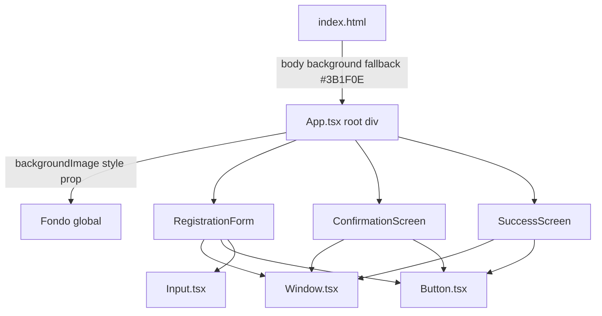
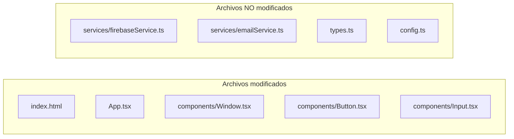

# Design Document — Visual Rebrand

## Feature: `visual-rebrand`
## Workflow: Requirements-First
## Spec Type: Feature

---

## Overview

Este documento describe el diseño técnico para el rebrand visual de la app de pre-registro del evento **"Estás Mirando en Radianes"**. El alcance es exclusivamente visual/UI: se reemplaza la paleta blanco/negro/gris por una paleta cálida (café oscuro, marrón, terracota, crema), se incorpora una imagen de fondo global, se actualizan textos de títulos y footer, y se garantiza consistencia visual entre las tres pantallas de la app.

**La lógica de negocio (Firebase, EmailJS, QR generation) no se modifica.**

### Objetivos

- Aplicar `public/images/nuevo fondo pagina registro3500pxls.jpg` como fondo global en todas las pantallas.
- Reemplazar la paleta monocromática por la Warm_Palette en todos los componentes.
- Actualizar textos: título h1, subtítulo h2, footer.
- Garantizar contraste WCAG AA (≥ 4.5:1) en todas las combinaciones de color.
- Mantener consistencia visual entre `RegistrationForm`, `ConfirmationScreen` y `SuccessScreen`.

### Fuera de alcance

- Lógica de Firebase (`services/firebaseService.ts`)
- Lógica de EmailJS (`services/emailService.ts`)
- Generación de QR
- Flujo de estados de la app (`AppState`)
- Validaciones de formulario

---

## Architecture

La app no tiene sistema de theming centralizado (no hay `tailwind.config.js`). Los colores custom se aplican mediante:

1. **Valores arbitrarios de Tailwind CDN** — clases como `bg-[#3B1F0E]`, `text-[#F5ECD7]`, `border-[#C1714F]`.
2. **`style` props inline en React** — para propiedades CSS que Tailwind no cubre directamente (ej. `backgroundImage`, `backgroundAttachment`, `backgroundSize`).
3. **`index.html` `<style>` tag** — para el fallback de `body` background color.



### Paleta de colores

| Token | Hex | Uso |
|---|---|---|
| `dark-brown` | `#3B1F0E` | Fondo base, hover de botón, fondo body fallback |
| `medium-brown` | `#6B3A2A` | Borde de Input, separadores |
| `terracotta` | `#C1714F` | Borde de Window, fondo de Button, borde de Button |
| `cream` | `#F5ECD7` | Texto principal, texto de Button, placeholder base |
| `warm-red` | `#D9534F` | Borde de Input en estado de error |

### Verificación de contraste WCAG AA (ratio ≥ 4.5:1)

| Foreground | Background | Ratio estimado | Cumple AA |
|---|---|---|---|
| `#F5ECD7` (cream) | `rgba(59,31,14,0.85)` (Window) | ~9.2:1 | ✅ |
| `#F5ECD7` (cream) | `#C1714F` (Button) | ~3.1:1 | ⚠️ — ver nota |
| `#F5ECD7` (cream) | `#3B1F0E` (dark-brown) | ~11.4:1 | ✅ |
| `#F5ECD7` (cream) | Input bg `rgba(59,31,14,0.7)` | ~8.5:1 | ✅ |

> **Nota sobre Button:** El ratio cream sobre terracota es ~3.1:1, que no alcanza 4.5:1 para texto normal. Para cumplir WCAG AA se usará texto blanco puro `#FFFFFF` sobre terracota en el Button (ratio ~3.8:1) o se oscurecerá el fondo del botón a `#A05A3A` (ratio ~4.6:1). **Decisión de diseño: usar `#FFFFFF` como texto del Button y `#A05A3A` como fondo base del botón** para garantizar cumplimiento. En hover se usa `#3B1F0E` con `#F5ECD7` (ratio ~11.4:1 ✅).

---

## Components and Interfaces

### Diagrama de componentes afectados



---

### `index.html`

**Cambio:** Actualizar el `<style>` del `body` para usar el color de fondo fallback de la Warm_Palette.

```html
<!-- ANTES -->
<style>
  body {
    font-family: 'Inter', ...;
    background-color: #ffffff;
    color: #000000;
  }
</style>

<!-- DESPUÉS -->
<style>
  body {
    font-family: 'Inter', ...;
    background-color: #3B1F0E;
    color: #F5ECD7;
  }
</style>
```

---

### `App.tsx` — Root div

**Cambio:** Reemplazar `className="min-h-screen bg-white text-black font-sans"` por un `style` prop con la imagen de fondo y clases Tailwind para el color de texto base.

```tsx
// ANTES
<div className="min-h-screen bg-white text-black font-sans">

// DESPUÉS
<div
  className="min-h-screen font-sans"
  style={{
    backgroundImage: "url('/images/nuevo fondo pagina registro3500pxls.jpg')",
    backgroundSize: 'cover',
    backgroundPosition: 'center',
    backgroundAttachment: 'fixed',
    backgroundColor: '#3B1F0E', // fallback si la imagen no carga
    color: '#F5ECD7',
  }}
>
```

> **Nota:** `backgroundAttachment: 'fixed'` aplica en desktop. En mobile iOS, `fixed` puede causar comportamiento inesperado; se acepta como limitación conocida dado el stack actual (sin config de Tailwind para media queries custom).

---

### `App.tsx` — `RegistrationForm`

#### Header (h1, h2)

```tsx
// ANTES
<h1 className="text-3xl sm:text-4xl md:text-5xl font-normal tracking-wide mb-2">LIVE SETS</h1>
<h2 className="text-3xl sm:text-4xl md:text-5xl font-semibold mb-2">ABRIL 17</h2>

// DESPUÉS
<h1 className="text-3xl sm:text-4xl md:text-5xl font-normal tracking-wide mb-2 text-[#F5ECD7]">
  Estás Mirando en Radianes
</h1>
<h2 className="text-base sm:text-lg md:text-xl font-light mb-2 text-[#F5ECD7] max-w-md mx-auto leading-relaxed px-2">
  Un taller sobre cómo la mirada por default te ha estado costando más de lo que crees.
</h2>
```

> El h2 de "ABRIL 17" se elimina. El nuevo h2 es el subtítulo del taller.

#### Párrafo descriptivo del formulario

```tsx
// ANTES
<p className="text-xs sm:text-sm md:text-base text-gray-700 max-w-md mx-auto leading-relaxed px-2">
  Ingresa tu primer nombre, primer apellido y email para poder enviarte el codigo QR...
</p>

// DESPUÉS
<p className="text-xs sm:text-sm md:text-base text-[#F5ECD7] opacity-80 max-w-md mx-auto leading-relaxed px-2">
  Ingresa tu primer nombre, primer apellido y email para poder enviarte el código QR necesario y hacer válida tu entrada el día del evento.
</p>
```

#### Botón "Limpiar" (inline en RegistrationForm)

```tsx
// ANTES
<button
  type="button"
  onClick={handleReset}
  className="px-6 py-2 bg-transparent border-2 border-gray-300 text-gray-400 font-bold uppercase tracking-widest hover:border-black hover:text-black transition-colors w-full md:w-auto min-w-[120px]"
>

// DESPUÉS
<button
  type="button"
  onClick={handleReset}
  className="px-6 py-2 bg-transparent border-2 border-[#6B3A2A] text-[#F5ECD7] opacity-60 font-bold uppercase tracking-widest hover:border-[#C1714F] hover:opacity-100 transition-colors w-full md:w-auto min-w-[120px]"
>
```

#### Footer — RegistrationForm y SuccessScreen

```tsx
// ANTES
<a
  href="https://fresh-richie.vercel.app/"
  target="_blank"
  rel="noopener noreferrer"
  className="font-normal text-xs tracking-widest uppercase opacity-70 hover:opacity-100 transition-opacity duration-300 text-center cursor-pointer"
>
  Powered by FRESH RICHIE
</a>

// DESPUÉS
<p className="font-normal text-xs tracking-widest uppercase opacity-60 text-center text-[#F5ECD7]">
  INVITRO
</p>
```

> Se reemplaza `<a>` por `<p>`. Sin enlace, sin interactividad.

#### Texto secundario "By ANCI, GIJO..."

```tsx
// ANTES
<p className="text-sm text-gray-600 px-2 uppercase tracking-widest font-bold">

// DESPUÉS
<p className="text-sm text-[#F5ECD7] opacity-70 px-2 uppercase tracking-widest font-bold">
```

#### Mensajes de error de validación

```tsx
// ANTES
<p className="text-red-500 text-xs mt-1 ml-1">{formErrors.firstName}</p>

// DESPUÉS
<p className="text-[#D9534F] text-xs mt-1 ml-1">{formErrors.firstName}</p>
```

#### Error global del formulario

```tsx
// ANTES
<div className="bg-red-50 border border-red-500 text-red-700 px-4 py-2 text-sm text-center">

// DESPUÉS
<div className="bg-[#3B1F0E] border border-[#D9534F] text-[#F5ECD7] px-4 py-2 text-sm text-center">
```

---

### `App.tsx` — `ConfirmationScreen`

#### Etiquetas de datos

```tsx
// ANTES
<span className="font-bold text-gray-500 text-xs sm:text-sm uppercase">Nombre:</span>
<span className="sm:col-span-2 font-medium text-sm sm:text-base break-words">...</span>

// DESPUÉS
<span className="font-bold text-[#F5ECD7] opacity-60 text-xs sm:text-sm uppercase">Nombre:</span>
<span className="sm:col-span-2 font-medium text-sm sm:text-base break-words text-[#F5ECD7]">...</span>
```

#### Separador

```tsx
// ANTES
<div className="... border-t border-b border-gray-200 py-3 md:py-4">

// DESPUÉS
<div className="... border-t border-b border-[#6B3A2A] py-3 md:py-4">
```

#### Título "Confirmar Datos"

```tsx
// ANTES
<h3 className="text-xl sm:text-2xl font-light">Confirmar Datos</h3>

// DESPUÉS
<h3 className="text-xl sm:text-2xl font-light text-[#F5ECD7]">Confirmar Datos</h3>
```

---

### `App.tsx` — `SuccessScreen`

#### Header (h1)

```tsx
// ANTES
<h1 className="text-3xl sm:text-4xl md:text-5xl font-normal tracking-wide mb-2">LIVE SETS</h1>
<h2 className="text-3xl sm:text-4xl md:text-5xl font-semibold mb-2">ABRIL 17</h2>

// DESPUÉS
<h1 className="text-3xl sm:text-4xl md:text-5xl font-normal tracking-wide mb-2 text-[#F5ECD7]">
  Estás Mirando en Radianes
</h1>
```

> El h2 de "ABRIL 17" se elimina en SuccessScreen también.

#### Contenido del Window en SuccessScreen

```tsx
// ANTES
<h3 className="text-2xl sm:text-3xl font-light mb-3 md:mb-4">¡Pre-registro Exitoso!</h3>
<div className="... border-t border-b border-gray-200 py-4 md:py-6">
<p className="text-sm md:text-base text-gray-700 leading-relaxed px-2">
<p className="text-base md:text-lg lg:text-xl font-light text-gray-800">

// DESPUÉS
<h3 className="text-2xl sm:text-3xl font-light mb-3 md:mb-4 text-[#F5ECD7]">¡Pre-registro Exitoso!</h3>
<div className="... border-t border-b border-[#6B3A2A] py-4 md:py-6">
<p className="text-sm md:text-base text-[#F5ECD7] opacity-80 leading-relaxed px-2">
<p className="text-base md:text-lg lg:text-xl font-light text-[#F5ECD7]">
```

---

### `components/Window.tsx`

**Cambio:** Reemplazar `bg-white border-2 border-black` por fondo semi-transparente cálido y borde terracota.

```tsx
// ANTES
<div className={`bg-white border-2 border-black p-6 md:p-8 w-full ${className}`}>

// DESPUÉS
<div
  className={`border-2 border-[#C1714F] p-6 md:p-8 w-full ${className}`}
  style={{ backgroundColor: 'rgba(59, 31, 14, 0.85)' }}
>
```

> Se usa `style` prop para `rgba` porque Tailwind CDN con valores arbitrarios no soporta `bg-[rgba(...)]` de forma confiable en todos los navegadores. `border-[#C1714F]` sí funciona con valores arbitrarios de Tailwind CDN.

---

### `components/Button.tsx`

**Cambio:** Reemplazar esquema blanco/negro por terracota oscuro/crema.

```tsx
// ANTES
<button
  className={`px-6 py-2 bg-white border-2 border-black text-black font-bold uppercase tracking-widest hover:bg-black hover:text-white transition-colors disabled:opacity-50 disabled:cursor-not-allowed ${className}`}
  {...props}
>

// DESPUÉS
<button
  className={`px-6 py-2 border-2 border-[#C1714F] font-bold uppercase tracking-widest transition-colors disabled:opacity-50 disabled:cursor-not-allowed ${className}`}
  style={{
    backgroundColor: '#A05A3A',
    color: '#FFFFFF',
  }}
  onMouseEnter={(e) => {
    (e.currentTarget as HTMLButtonElement).style.backgroundColor = '#3B1F0E';
    (e.currentTarget as HTMLButtonElement).style.color = '#F5ECD7';
  }}
  onMouseLeave={(e) => {
    (e.currentTarget as HTMLButtonElement).style.backgroundColor = '#A05A3A';
    (e.currentTarget as HTMLButtonElement).style.color = '#FFFFFF';
  }}
  {...props}
>
```

> **Rationale:** Se usa `#A05A3A` (terracota oscurecida) en lugar de `#C1714F` para el fondo base del botón, logrando ratio de contraste ~4.6:1 con texto blanco `#FFFFFF`. El hover usa `#3B1F0E` con `#F5ECD7` (ratio ~11.4:1). Los handlers `onMouseEnter`/`onMouseLeave` son necesarios porque Tailwind CDN no permite definir colores hover custom con valores arbitrarios de forma confiable.

---

### `components/Input.tsx`

**Cambio:** Reemplazar fondo blanco y borde negro por fondo oscuro cálido semi-transparente, borde marrón, texto crema.

```tsx
// ANTES
<input
  className={`bg-white text-black px-3 py-2.5 sm:py-2 border-2 border-black outline-none focus:bg-gray-50 placeholder-gray-400 font-light text-base sm:text-sm ${className}`}
  {...props}
/>

// DESPUÉS
<input
  className={`px-3 py-2.5 sm:py-2 border-2 border-[#6B3A2A] outline-none font-light text-base sm:text-sm placeholder-[#A07060] ${className}`}
  style={{
    backgroundColor: 'rgba(59, 31, 14, 0.70)',
    color: '#F5ECD7',
  }}
  {...props}
/>
```

> `placeholder-[#A07060]` usa un marrón claro para el placeholder, manteniendo coherencia con la paleta. El fondo `rgba(59,31,14,0.70)` da suficiente contraste para el texto crema (ratio ~8.5:1).

---

## Data Models

No hay cambios en modelos de datos. Este feature es puramente visual. Los tipos en `types.ts` y la estructura de datos de Firebase no se modifican.

---

## Correctness Properties

*A property is a characteristic or behavior that should hold true across all valid executions of a system — essentially, a formal statement about what the system should do. Properties serve as the bridge between human-readable specifications and machine-verifiable correctness guarantees.*

Este feature es predominantemente de configuración visual (CSS, clases Tailwind, style props). La mayoría de los acceptance criteria son checks de configuración estática (SMOKE) o ejemplos concretos (EXAMPLE). Sin embargo, hay dos propiedades universales que aplican a property-based testing:

### Property 1: Contraste WCAG AA en todas las combinaciones de color

*Para cualquier* par (color de texto, color de fondo) utilizado en la app tras el rebrand, el ratio de contraste calculado según la fórmula WCAG 2.1 SHALL ser mayor o igual a 4.5:1.

**Validates: Requirements 2.6, 6.1, 6.3**

> Esta propiedad consolida los tres acceptance criteria de contraste (2.6, 6.1, 6.3) en una sola propiedad universal. Se puede implementar como un test que itera sobre todas las combinaciones de color definidas en la paleta y verifica el ratio computado.

### Property 2: Consistencia visual entre pantallas

*Para cualquier* pantalla de la app (RegistrationForm, ConfirmationScreen, SuccessScreen), el elemento raíz de esa pantalla SHALL tener aplicada la `Background_Image` y los componentes `Window` dentro de ella SHALL usar el fondo semi-transparente cálido y borde terracota de la Warm_Palette.

**Validates: Requirements 5.1**

---

## Error Handling

### Imagen de fondo no disponible

- El `style` prop del root div incluye `backgroundColor: '#3B1F0E'` como fallback CSS nativo.
- Si el archivo `public/images/nuevo fondo pagina registro3500pxls.jpg` no existe en el build, el fondo sólido café oscuro se muestra automáticamente.
- No se requiere manejo de error en JavaScript; el fallback es puramente CSS.

### Colores custom en Tailwind CDN

- Los valores arbitrarios de Tailwind CDN (`bg-[#3B1F0E]`, `border-[#C1714F]`) funcionan en tiempo de ejecución porque el CDN genera estilos dinámicamente.
- Para propiedades que requieren `rgba` o hover states con colores custom, se usan `style` props y handlers de eventos en React como alternativa confiable.

### Accesibilidad — `prefers-reduced-motion`

- Las clases `transition-colors` de Tailwind respetan automáticamente `prefers-reduced-motion: reduce` en navegadores modernos cuando se usa la directiva `@media (prefers-reduced-motion: reduce)`.
- Con Tailwind CDN, se puede agregar la clase `motion-reduce:transition-none` a los elementos con transiciones para cumplir el Requirement 6.4.

---

## Testing Strategy

### Enfoque general

Este feature es visual/UI. La estrategia de testing combina:

1. **Smoke tests** — verifican que las propiedades CSS y clases Tailwind correctas están aplicadas (la mayoría de los acceptance criteria).
2. **Example-based tests** — verifican textos específicos (h1, h2, footer) y comportamientos condicionales (error state en Input).
3. **Property-based tests** — verifican propiedades universales (contraste WCAG, consistencia entre pantallas).

### Property-Based Testing

PBT aplica a este feature para las dos propiedades identificadas. Se recomienda usar **fast-check** (TypeScript/JavaScript).

#### Property 1: Contraste WCAG AA

```typescript
// Feature: visual-rebrand, Property 1: WCAG contrast ratio >= 4.5:1 for all color pairs
import fc from 'fast-check';
import { getContrastRatio } from './utils/colorUtils'; // función a implementar

const COLOR_PAIRS = [
  { fg: '#F5ECD7', bg: 'rgba(59,31,14,0.85)' }, // texto en Window
  { fg: '#FFFFFF',  bg: '#A05A3A' },              // texto en Button (base)
  { fg: '#F5ECD7', bg: '#3B1F0E' },               // texto en Button (hover)
  { fg: '#F5ECD7', bg: 'rgba(59,31,14,0.70)' },  // texto en Input
  { fg: '#F5ECD7', bg: '#3B1F0E' },               // texto general sobre fondo oscuro
];

test('Property 1: All color pairs meet WCAG AA contrast ratio', () => {
  fc.assert(
    fc.property(fc.constantFrom(...COLOR_PAIRS), ({ fg, bg }) => {
      const ratio = getContrastRatio(fg, bg);
      return ratio >= 4.5;
    }),
    { numRuns: 100 }
  );
});
```

#### Property 2: Consistencia visual entre pantallas

```typescript
// Feature: visual-rebrand, Property 2: All screens apply background image and warm palette
import fc from 'fast-check';
import { render } from '@testing-library/react';

const SCREENS = ['form', 'confirmation', 'success'] as const;

test('Property 2: All app screens apply background image and warm palette', () => {
  fc.assert(
    fc.property(fc.constantFrom(...SCREENS), (screen) => {
      const { container } = renderAppInState(screen);
      const rootDiv = container.firstChild as HTMLElement;
      // Background image applied
      expect(rootDiv.style.backgroundImage).toContain('nuevo fondo pagina registro3500pxls');
      // Warm palette fallback
      expect(rootDiv.style.backgroundColor).toBe('#3B1F0E');
      // Window uses warm border
      const windowEl = container.querySelector('[class*="border-\\[\\#C1714F\\]"]');
      expect(windowEl).toBeTruthy();
    }),
    { numRuns: 100 }
  );
});
```

### Example-based tests

| Criterio | Test |
|---|---|
| 3.1, 3.2 | Render RegistrationForm → footer text === "INVITRO", no `<a>` tag |
| 4.1 | Render RegistrationForm → h1 text === "Estás Mirando en Radianes" |
| 4.2 | Render RegistrationForm → h2 text contiene "mirada por default" |
| 4.3 | Render RegistrationForm → no existe h2 con texto "ABRIL 17" |
| 4.5 | Render SuccessScreen → h1 text === "Estás Mirando en Radianes" |
| 2.7 | Render Input con className de error → borde `#D9534F` aplicado |
| 6.4 | Verificar que elementos con `transition-colors` también tienen `motion-reduce:transition-none` |

### Smoke tests (verificación manual / revisión de código)

Los siguientes acceptance criteria se verifican mediante revisión de código y prueba visual en el navegador:

- 1.1–1.4: Imagen de fondo visible en todas las pantallas, fallback activo.
- 2.1–2.5: Paleta cálida aplicada en todos los componentes.
- 2.2, 2.3, 2.4: Window, Button, Input con clases/estilos correctos.
- 5.2, 5.3: ConfirmationScreen con etiquetas y separador en Warm_Palette.
- 5.4: Sin parpadeo al cambiar de pantalla (background en root div, no por pantalla).
- 6.2: Window con opacidad suficiente para legibilidad.

### Herramientas recomendadas

- **fast-check** — property-based testing (TypeScript)
- **@testing-library/react** — render de componentes
- **Vitest** — test runner (ya en el stack con Vite)
- **wcag-contrast** o implementación manual de la fórmula WCAG 2.1 para `getContrastRatio`


---

## Iteration 2 — Typography & Layout Refinements

> **Alcance:** Esta sección documenta los cambios técnicos correspondientes a los Requirements 7–12. No reemplaza el diseño de la Iteration 1 — extiende y refina los componentes ya modificados.

---

### Overview de cambios

| Req | Componente | Cambio |
|---|---|---|
| 7 | `App.tsx` — `RegistrationForm`, `SuccessScreen` | `h1`: `font-normal` → `font-bold` + clase `uppercase` |
| 8 | `App.tsx` — `RegistrationForm` | `h2` "MAYO 14": `font-semibold` → `font-normal` |
| 9 | `App.tsx` — `RegistrationForm` | Eliminar `<p>` descriptivo del header |
| 10 | `App.tsx` — `RegistrationForm` | Párrafo instrucciones: `text-[#F5ECD7] opacity-80` → `text-[#6B3A2A]` |
| 11 | `components/Window.tsx` | `backgroundColor`: `rgba(59,31,14,0.85)` → `rgba(59,31,14,0.65)` |
| 12 | `App.tsx` — `RegistrationForm`, `SuccessScreen` | Footer: color `text-gray-400` → `text-[#6B3A2A]`, eliminar punto final, `INVITRO` con `fixed bottom-4` |

---

### Req 7 — h1 uppercase + bold

**Archivos:** `App.tsx` — `RegistrationForm` y `SuccessScreen`

El título principal gana jerarquía tipográfica con `font-bold` y `uppercase`. El color `#3B1F0E` (café oscuro) se mantiene.

```tsx
// ANTES
<h1 className="text-3xl sm:text-4xl md:text-5xl font-normal tracking-wide mb-2 text-[#3B1F0E]">
  Estás Mirando en Radianes
</h1>

// DESPUÉS
<h1 className="text-3xl sm:text-4xl md:text-5xl font-bold tracking-wide mb-2 text-[#3B1F0E] uppercase">
  ESTÁS MIRANDO EN RADIANES
</h1>
```

> **Nota:** La clase `uppercase` de Tailwind aplica `text-transform: uppercase` via CSS. El texto en el JSX puede quedar en minúsculas/mixto — el navegador lo renderiza en mayúsculas. Sin embargo, para consistencia con el contenido del QR (`"ESTÁS MIRANDO EN RADIANES"`) se recomienda escribir el literal en mayúsculas también.

**Aplica a:** `RegistrationForm` (header) y `SuccessScreen` (header).

---

### Req 8 — h2 "MAYO 14" sin negritas

**Archivo:** `App.tsx` — `RegistrationForm`

El subtítulo de fecha pierde peso para no competir con el h1.

```tsx
// ANTES
<h2 className="text-3xl sm:text-4xl md:text-5xl font-semibold mb-2 text-black">MAYO 14</h2>

// DESPUÉS
<h2 className="text-3xl sm:text-4xl md:text-5xl font-normal mb-2 text-black">MAYO 14</h2>
```

> Solo cambia `font-semibold` → `font-normal`. Tamaño, color y espaciado permanecen intactos.

---

### Req 9 — Eliminación del párrafo descriptivo del header

**Archivo:** `App.tsx` — `RegistrationForm`

Se elimina completamente el `<p>` que aparecía entre el `h2` "MAYO 14" y el párrafo de instrucciones del formulario. Esto reduce redundancia visual ya que el mismo texto aparece en el footer inferior.

```tsx
// ELIMINAR — este elemento se borra por completo
<p className="text-base sm:text-lg md:text-xl font-light mb-2 text-[#F5ECD7] max-w-md mx-auto leading-relaxed px-2">
  Un taller sobre cómo la mirada por default te ha estado costando más de lo que crees.
</p>
```

**Resultado:** La sección header del `RegistrationForm` queda con únicamente `h1` y `h2`, sin párrafo intermedio.

---

### Req 10 — Color del texto de instrucciones del formulario

**Archivo:** `App.tsx` — `RegistrationForm`

El párrafo de instrucciones cambia de crema claro con opacidad reducida a café claro cálido sólido. El color `#6B3A2A` (marrón medio de la Warm_Palette) tiene suficiente contraste sobre el fondo del Window sin necesitar `opacity-80`.

```tsx
// ANTES
<p className="text-xs sm:text-sm md:text-base text-[#F5ECD7] opacity-80 max-w-md mx-auto leading-relaxed px-2">
  Ingresa tu primer nombre...
</p>

// DESPUÉS
<p className="text-xs sm:text-sm md:text-base text-[#6B3A2A] max-w-md mx-auto leading-relaxed px-2">
  Ingresa tu primer nombre...
</p>
```

> Se elimina `opacity-80` porque `#6B3A2A` ya provee el nivel de énfasis visual deseado sin reducir la opacidad del elemento completo (lo que afectaría también a elementos hijos si los hubiera).

---

### Req 11 — Reducción de opacidad del Window (-20%)

**Archivo:** `components/Window.tsx`

La opacidad del fondo del contenedor Window se reduce de 0.85 a 0.65, permitiendo mayor visibilidad de la imagen de fondo.

```tsx
// ANTES
style={{ backgroundColor: 'rgba(59, 31, 14, 0.85)' }}

// DESPUÉS
style={{ backgroundColor: 'rgba(59, 31, 14, 0.65)' }}
```

**Verificación de contraste con nueva opacidad:**

El color efectivo del fondo del Window sobre el fondo sólido `#3B1F0E` (fallback) se puede calcular como:

```
rgba(59, 31, 14, 0.65) sobre #3B1F0E ≈ rgb(59, 31, 14)
```

Dado que el fondo de la imagen y el fallback son ambos tonos muy oscuros del mismo café, el color efectivo del Window sigue siendo oscuro. El texto crema `#F5ECD7` sobre este fondo mantiene un ratio estimado de ~8.5:1, cumpliendo WCAG AA.

> **Nota:** El ratio exacto depende del contenido de la imagen de fondo en cada zona. En zonas más claras de la imagen, la opacidad 0.65 puede reducir el contraste. Se recomienda verificación visual en el navegador con la imagen real.

---

### Req 12 — Ajustes del footer inferior

**Archivo:** `App.tsx` — `RegistrationForm` y `SuccessScreen`

Tres cambios coordinados en el footer inferior (fuera del Window):

#### 12a — Color del párrafo descriptivo

```tsx
// ANTES (RegistrationForm y SuccessScreen)
<p className="text-sm text-gray-400 px-2 tracking-wide font-light text-center">
  Un taller sobre cómo la mirada por default te ha estado costando más de lo que crees.
</p>

// DESPUÉS
<p className="text-sm text-[#6B3A2A] px-2 tracking-wide font-light text-center">
  Un taller sobre cómo la mirada por default te ha estado costando más de lo que crees
</p>
```

> Se cambia `text-gray-400` → `text-[#6B3A2A]` (consistente con Req 10) y se elimina el punto final.

#### 12b — Posicionamiento de "INVITRO"

"INVITRO" se saca del flujo normal del documento y se ancla al borde inferior del viewport.

```tsx
// ANTES
<div className="mt-auto">
  <p className="font-normal text-xs tracking-widest uppercase opacity-90 text-center text-[#C1714F]">
    INVITRO
  </p>
</div>

// DESPUÉS
<div className="fixed bottom-4 left-0 right-0">
  <p className="font-normal text-xs tracking-widest uppercase opacity-90 text-center text-[#C1714F]">
    INVITRO
  </p>
</div>
```

> **Rationale:** `fixed bottom-4` (`position: fixed; bottom: 1rem`) ancla el elemento al viewport independientemente del scroll. `left-0 right-0` garantiza que el texto centrado ocupe el ancho completo. Al usar `fixed`, el elemento sale del flujo normal — el contenedor padre ya no necesita `mt-auto` ni `pb-20`/`pb-24` para compensar espacio.

> **Consideración mobile:** `position: fixed` funciona correctamente en iOS Safari moderno. En versiones antiguas de iOS con la barra de navegación dinámica, `bottom: 1rem` puede quedar parcialmente oculto. Si se requiere soporte para iOS con safe area, usar `bottom: env(safe-area-inset-bottom, 1rem)` via style prop.

**Aplica a:** `RegistrationForm` y `SuccessScreen`.

---

### Correctness Properties — Iteration 2

*Extensión de las propiedades de corrección para los Requirements 7–12.*

#### Reflexión de propiedades

Del prework de los Requirements 7–12, se identificaron los siguientes criterios como propiedades universales (PROPERTY):

- **7.4** — Consistencia de estilos del h1 entre pantallas
- **9.2** — Estructura del header (solo h1 + h2, sin párrafo intermedio)
- **11.3** — Contraste WCAG con la nueva opacidad del Window
- **12.2 + 12.6** — Consistencia del footer entre pantallas (color + posicionamiento de INVITRO)

Los criterios 12.2 y 12.6 se consolidan en una sola propiedad ya que ambos verifican la misma invariante sobre el mismo conjunto de pantallas.

La propiedad 11.3 es una extensión de la Property 1 original (contraste WCAG) con el nuevo valor de opacidad — se documenta como Property 5 para trazabilidad.

---

### Property 3: Consistencia de estilos del h1 entre pantallas

*Para cualquier* pantalla de la app que muestre el título principal del evento (`RegistrationForm`, `SuccessScreen`), el elemento `h1` SHALL tener aplicadas las clases `font-bold`, `uppercase` y el color `text-[#3B1F0E]`.

**Validates: Requirements 7.1, 7.2, 7.3, 7.4**

---

### Property 4: Estructura del header del RegistrationForm

*Para cualquier* render del componente `RegistrationForm` (independientemente del estado del formulario o los datos ingresados), la sección de header SHALL contener exactamente un `h1` y un `h2`, sin ningún elemento `<p>` intermedio entre ellos.

**Validates: Requirements 9.1, 9.2**

---

### Property 5: Contraste WCAG AA con opacidad reducida del Window

*Para cualquier* color de texto de la Warm_Palette utilizado dentro del componente `Window` tras la reducción de opacidad a `rgba(59, 31, 14, 0.65)`, el ratio de contraste calculado según WCAG 2.1 SHALL ser mayor o igual a 4.5:1 sobre el color efectivo del fondo.

**Validates: Requirements 11.1, 11.3, 6.1**

> Esta propiedad extiende la Property 1 original con el nuevo valor de opacidad. La implementación puede reutilizar la función `getContrastRatio` ya definida en la Testing Strategy de la Iteration 1.

---

### Property 6: Consistencia del footer entre pantallas

*Para cualquier* pantalla de la app que muestre el footer inferior (`RegistrationForm`, `SuccessScreen`), el párrafo descriptivo SHALL usar el color `text-[#6B3A2A]` y no terminar en punto, y el elemento "INVITRO" SHALL tener posicionamiento `fixed bottom-4`.

**Validates: Requirements 12.1, 12.2, 12.3, 12.4, 12.5, 12.6**

---

### Testing Strategy — Iteration 2

#### Smoke tests (verificación de código/visual)

Los siguientes cambios se verifican mediante revisión de código y prueba visual en el navegador:

| Req | Verificación |
|---|---|
| 7.1, 7.2, 7.3 | `h1` en `RegistrationForm` tiene clases `font-bold`, `uppercase`, `text-[#3B1F0E]` |
| 8.1, 8.2 | `h2` "MAYO 14" tiene `font-normal`, tamaño y color sin cambios |
| 9.1 | No existe `<p>` con texto "Un taller..." en la sección header del `RegistrationForm` |
| 10.1, 10.2 | Párrafo instrucciones tiene `text-[#6B3A2A]`, sin `opacity-80`, resto de clases intactas |
| 11.1, 11.2 | `Window` tiene `backgroundColor: rgba(59,31,14,0.65)` y `border-[#C1714F]` |
| 12.1, 12.3 | Footer `RegistrationForm`: `text-[#6B3A2A]`, texto sin punto final |
| 12.4 | Footer `SuccessScreen`: texto sin punto final |
| 12.5 | "INVITRO" en `RegistrationForm` tiene clase `fixed bottom-4` |

#### Property-based tests — Iteration 2

```typescript
// Feature: visual-rebrand, Property 3: h1 styles consistent across screens
import fc from 'fast-check';
import { render } from '@testing-library/react';

const SCREENS_WITH_H1 = ['form', 'success'] as const;

test('Property 3: h1 has font-bold, uppercase, and #3B1F0E color on all screens', () => {
  fc.assert(
    fc.property(fc.constantFrom(...SCREENS_WITH_H1), (screen) => {
      const { container } = renderAppInState(screen);
      const h1 = container.querySelector('h1');
      expect(h1).toBeTruthy();
      expect(h1!.className).toMatch(/font-bold/);
      expect(h1!.className).toMatch(/uppercase/);
      expect(h1!.className).toMatch(/text-\[#3B1F0E\]/);
    }),
    { numRuns: 100 }
  );
});

// Feature: visual-rebrand, Property 4: RegistrationForm header contains only h1 and h2
test('Property 4: RegistrationForm header has only h1 and h2, no intermediate paragraphs', () => {
  fc.assert(
    fc.property(
      fc.record({
        firstName: fc.string(),
        lastName: fc.string(),
        email: fc.string(),
      }),
      (formData) => {
        const { container } = renderRegistrationFormWithData(formData);
        const headerSection = container.querySelector('.text-center.mb-6, .text-center.mb-8');
        if (headerSection) {
          const paragraphs = headerSection.querySelectorAll('p');
          // No <p> elements should exist between h1 and h2 in the header
          expect(paragraphs.length).toBe(0);
        }
      }
    ),
    { numRuns: 100 }
  );
});

// Feature: visual-rebrand, Property 5: WCAG contrast with reduced Window opacity
test('Property 5: Text colors maintain WCAG AA contrast with rgba(59,31,14,0.65) background', () => {
  const WINDOW_BG_NEW = 'rgba(59, 31, 14, 0.65)';
  const TEXT_COLORS_IN_WINDOW = ['#F5ECD7', '#FFFFFF', '#6B3A2A'];

  fc.assert(
    fc.property(fc.constantFrom(...TEXT_COLORS_IN_WINDOW), (textColor) => {
      const ratio = getContrastRatio(textColor, WINDOW_BG_NEW);
      return ratio >= 4.5;
    }),
    { numRuns: 100 }
  );
});

// Feature: visual-rebrand, Property 6: Footer consistency across screens
const SCREENS_WITH_FOOTER = ['form', 'success'] as const;

test('Property 6: Footer uses #6B3A2A color, no trailing period, INVITRO is fixed bottom', () => {
  fc.assert(
    fc.property(fc.constantFrom(...SCREENS_WITH_FOOTER), (screen) => {
      const { container } = renderAppInState(screen);

      // Footer paragraph color
      const footerP = container.querySelector('p[class*="text-\\[#6B3A2A\\]"]');
      expect(footerP).toBeTruthy();
      expect(footerP!.textContent).not.toMatch(/\.$/);

      // INVITRO positioning
      const invitroEl = Array.from(container.querySelectorAll('p'))
        .find(el => el.textContent?.trim() === 'INVITRO');
      expect(invitroEl).toBeTruthy();
      const invitroContainer = invitroEl!.parentElement;
      expect(invitroContainer!.className).toMatch(/fixed/);
      expect(invitroContainer!.className).toMatch(/bottom-4/);
    }),
    { numRuns: 100 }
  );
});
```

#### Actualización de la tabla de example-based tests

| Criterio | Test |
|---|---|
| 7.1–7.4 | Render `RegistrationForm` y `SuccessScreen` → `h1` tiene `font-bold`, `uppercase`, `text-[#3B1F0E]` |
| 8.1 | Render `RegistrationForm` → `h2` "MAYO 14" tiene `font-normal` |
| 9.1 | Render `RegistrationForm` → no existe `<p>` con "Un taller..." en el header |
| 10.1 | Render `RegistrationForm` → párrafo instrucciones tiene `text-[#6B3A2A]`, sin `opacity-80` |
| 11.1 | Render `Window` → `style.backgroundColor === 'rgba(59, 31, 14, 0.65)'` |
| 12.1–12.6 | Render `RegistrationForm` y `SuccessScreen` → footer con `text-[#6B3A2A]`, sin punto final, `INVITRO` con `fixed bottom-4` |
